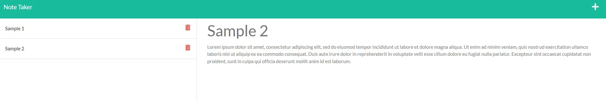

# Note-Taker

## Description

This web application was designed for users who want to write notes and save them, it uses express.js, node, HTML and CSS. This project had a very steep learning curve for me where I had to learn Express and Heroku which was a little difficult but I got there in the end.

## Table of Contents

- [Installation](#installation)
- [Usage](#usage)
- [Credits](#credits)
- [License](#license)

## Installation

This web app has been uploaded to the following website: https://matthew-note-taker.herokuapp.com/

## Usage
- Main Page

- Note taking page

- Note taking fields

- Sample text inputed

- Saved Samples screen of notes

- Save button

-Add note button

-Delete note button

## Credits

- Ask BCS team @ Monash university Bootcamp
- Tutor for keeping me on track
- https://developer.mozilla.org/en-US/docs/Learn/Server-side/Express_Nodejs/routes
- https://2ality.com/2017/05/util-promisify.html
- https://www.w3schools.com/nodejs/
- https://developer.mozilla.org/en-US/docs/Learn/Server-side/Express_Nodejs

## License

MIT License

Copyright (c) 2022 breakfireaus

Permission is hereby granted, free of charge, to any person obtaining a copy
of this software and associated documentation files (the "Software"), to deal
in the Software without restriction, including without limitation the rights
to use, copy, modify, merge, publish, distribute, sublicense, and/or sell
copies of the Software, and to permit persons to whom the Software is
furnished to do so, subject to the following conditions:

The above copyright notice and this permission notice shall be included in all
copies or substantial portions of the Software.

THE SOFTWARE IS PROVIDED "AS IS", WITHOUT WARRANTY OF ANY KIND, EXPRESS OR
IMPLIED, INCLUDING BUT NOT LIMITED TO THE WARRANTIES OF MERCHANTABILITY,
FITNESS FOR A PARTICULAR PURPOSE AND NONINFRINGEMENT. IN NO EVENT SHALL THE
AUTHORS OR COPYRIGHT HOLDERS BE LIABLE FOR ANY CLAIM, DAMAGES OR OTHER
LIABILITY, WHETHER IN AN ACTION OF CONTRACT, TORT OR OTHERWISE, ARISING FROM,
OUT OF OR IN CONNECTION WITH THE SOFTWARE OR THE USE OR OTHER DEALINGS IN THE
SOFTWARE.

